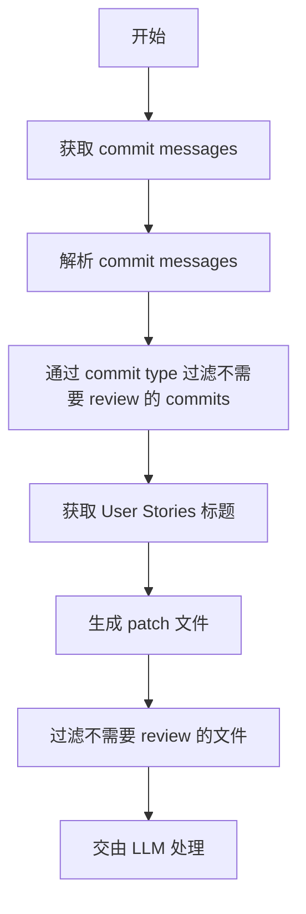

# CodeReview Design



## Prompt 策略

1. 如果变更的代码行数少，则只审核业务含义 —— 根据提交信息，解析对应的 story 名称，然后进行检查。
2. 根据变更的代码，生成对应的代码信息，作为上下文的一部分。
3. 如果变更的行数多，则需要进行代码逻辑的检查，以及对应的语法检查。
4. 如果单次变更的行数过多，则需要进行拆分。

### M1：提交格式解析

格式：Conventional Commits

解析库：[git-commit-message](https://github.com/unit-mesh/chocolate-factory/tree/master/code-modules/git-commit-message) (Chocolate Factory)

标准格式：

```
<type>[optional scope］：<subject>

[optional description]
[optional footer（s）］
```

示例：

```
feat(ng-list): Allow custom separator Closes #123 Closes #25 Fixes #33
```

会生成三个 CommitReference：123，25，33

### M1：条件过滤

可配置的条件过滤

1. 根据提交信息中的 type 过滤，如忽略：docs, chore, style 等。
2. 根据文件路径过滤，如忽略：.md, .json 等。

### M1：基本的 Patch 优化

1. 如果变更的代码行数少，则只审核业务含义。
2. 处理文件目录移动，文件重命名的情况。（即忽略文件的变更）
3. 使用传统工具，检测语法问题，诸如 pre-commit 的情况。

### M2：Patch 优化

1. 如果超过 10 个文件，则需要拆分。
    - 忽略数据文件。
    - 忽略配置文件。
2. 如果单个行数变更大，则直接 review 原函数。

### M2：重写比例

1. 如果重写比例过高，则需要进行代码逻辑的检查，结合更多的上下文。（重写比例：重写的代码行数 / 总代码行数，建议小于 0.5，行数大于
   30 / 2 行）
2. 当出现重大变化时，建议进行人工检查。
